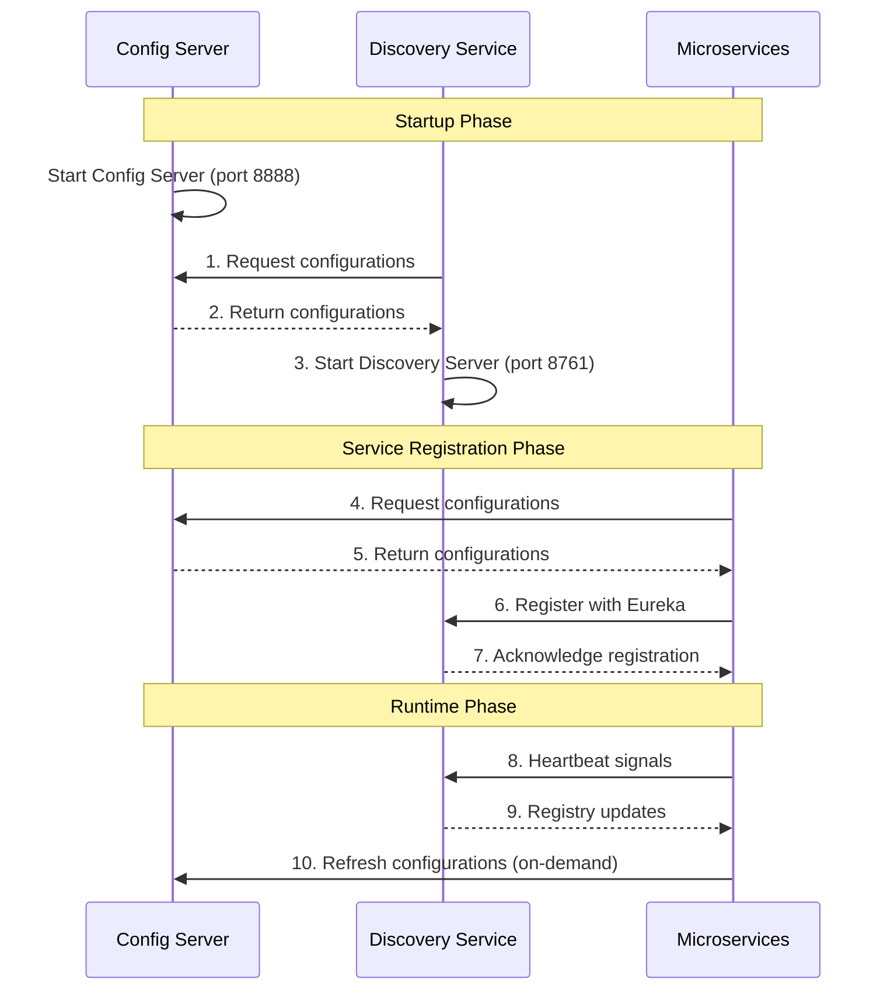

```mermaid
sequenceDiagram
    participant C as Config Server
    participant D as Discovery Service
    participant MS as Microservices
    
    Note over C,MS: Startup Phase
    C->>C: Start Config Server (port 8888)
    D->>C: 1. Request configurations
    C-->>D: 2. Return configurations
    D->>D: 3. Start Discovery Server (port 8761)
    
    Note over C,MS: Service Registration Phase
    MS->>C: 4. Request configurations
    C-->>MS: 5. Return configurations
    MS->>D: 6. Register with Eureka
    D-->>MS: 7. Acknowledge registration

    Note over C,MS: Runtime Phase
    MS->>D: 8. Heartbeat signals
    D-->>MS: 9. Registry updates
    MS->>C: 10. Refresh configurations (on-demand)
```