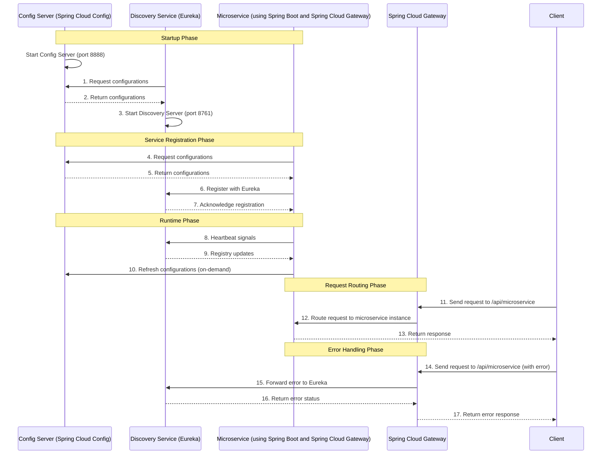

```mermaid
sequenceDiagram
    participant C as Config Server
    participant D as Discovery Service
    participant MS as Microservices
    participant C as Config Server (Spring Cloud Config)
    participant D as Discovery Service (Eureka)
    participant MS as Microservice (using Spring Boot and Spring Cloud Gateway)
    participant SG as Spring Cloud Gateway
    
    Note over C,MS: Startup Phase
    C->>C: Start Config Server (port 8888)
    D->>C: 1. Request configurations
    C-->>D: 2. Return configurations
    D->>D: 3. Start Discovery Server (port 8761)
    
    Note over C,MS: Service Registration Phase
    MS->>C: 4. Request configurations
    C-->>MS: 5. Return configurations
    MS->>D: 6. Register with Eureka
    D-->>MS: 7. Acknowledge registration

    Note over C,MS: Runtime Phase
    MS->>D: 8. Heartbeat signals
    D-->>MS: 9. Registry updates
    MS->>C: 10. Refresh configurations (on-demand)
    
    Note over SG,MS: Request Routing Phase
    Client ->> SG: 11. Send request to /api/microservice
    SG->>MS: 12. Route request to microservice instance
    MS-->>Client: 13. Return response
    
    Note over SG,MS: Error Handling Phase
    Client ->> SG: 14. Send request to /api/microservice (with error)
    SG->>D: 15. Forward error to Eureka
    D-->>SG: 16. Return error status
    SG-->>Client: 17. Return error response

```