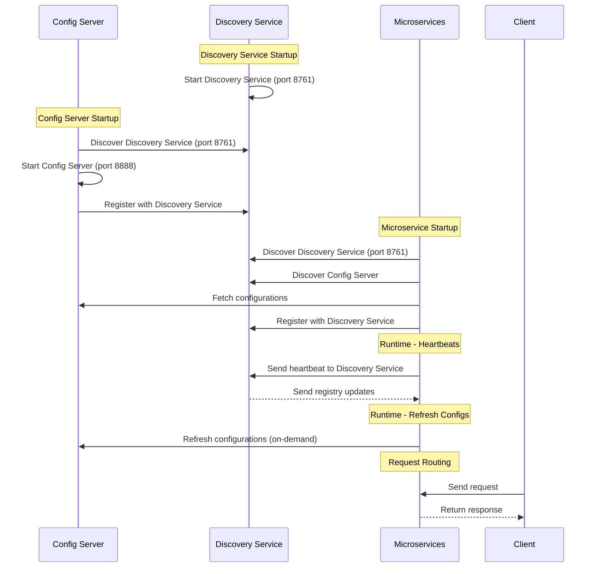

```mermaid
sequenceDiagram
    participant C as Config Server
    participant D as Discovery Service
    participant MS as Microservices
    

    Note over D: Discovery Service Startup
    D->>D: Start Discovery Service (port 8761)
    
    Note over C: Config Server Startup
    C->>D: Discover Discovery Service (port 8761)
    C->>C: Start Config Server (port 8888)
    C->>D: Register with Discovery Service

    Note over MS: Microservice Startup
    MS->>D: Discover Discovery Service (port 8761)
    MS->>D: Discover Config Server
    MS->>C: Fetch configurations
    MS->>D: Register with Discovery Service

    Note over MS: Runtime - Heartbeats
    MS->>D: Send heartbeat to Discovery Service
    D-->>MS: Send registry updates

    Note over MS: Runtime - Refresh Configs
    MS->>C: Refresh configurations (on-demand)
    
    Note over MS: Request Routing
    Client ->> MS: Send request
    MS-->>Client: Return response

```